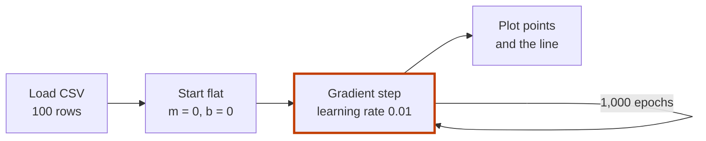

# Linear Regression from Scratch

[](https://www.python.org/)
[](https://pandas.pydata.org/)
[](https://matplotlib.org/)
[](LICENSE)

**Fits a straight line to study hours and exam scores with hand-written gradient descent, no machine learning library.**

Say a student studies 5 hours. What score should they expect?
The script draws the best straight line through 100 students' hours and scores, and the line gives the answer.
It finds that line by itself: start flat, measure the error, nudge the line, repeat 1,000 times.

- **What it does:** learns the slope `m` and intercept `b` of `score = m × hours + b`.
- **Why you can follow it:** 54 lines of plain Python. The loss and both gradients are written out by hand.
- **What it uses:** pandas reads the CSV and Matplotlib draws the result. There is no scikit-learn.

A learning project about how linear regression works under the hood.
Its sibling study: [PPO from scratch](https://github.com/Estaed/PPO_Scratch), a reinforcement learning algorithm written by hand in PyTorch.

## Quick start

```bash
git clone https://github.com/Estaed/Linear_Regression_Scratch.git
cd Linear_Regression_Scratch
pip install pandas matplotlib
python LR_Scratch.py
```

The script prints the loss every 100 epochs, then the final `m` and `b`.
Then it opens a plot: the data points in black and the fitted line in red.
Run it from the repo folder. It reads `study_hours_vs_exam_scores.csv` from the current directory.

## How it works



1. **Load.** `study_hours_vs_exam_scores.csv` has two columns, `Study` (hours) and `Score`.
2. **Start flat.** The line begins at `m = 0`, `b = 0`.
3. **Measure the error.** The loss is the mean squared error between each score and the line's guess.
4. **Step downhill.** The gradient of that error says how to change `m` and `b`. Each epoch moves them a little (learning rate 0.01).
5. **Repeat and show.** After 1,000 epochs the script prints `m` and `b` and plots the line over the data.

<details>
<summary><b>The maths in the code</b> (hypothesis, cost, gradients)</summary>

For `n` points `(x, y)`:

- **Hypothesis:** `ŷ = m·x + b`
- **Cost (mean squared error):** `L = (1/n) Σ (y − (m·x + b))²` (`loss_function`)
- **Gradients:** `∂L/∂m = −(2/n) Σ x·(y − (m·x + b))` and `∂L/∂b = −(2/n) Σ (y − (m·x + b))` (`gradient_descent`)
- **Update:** `m ← m − lr·∂L/∂m` and `b ← b − lr·∂L/∂b`

Concepts covered: the hypothesis function, the cost function, gradient descent, and checking the fit by its loss and the plot.

</details>

<details>
<summary><b>Files in this repository</b></summary>

| Path | What it is |
|---|---|
| `LR_Scratch.py` | Loads the data, trains the model, prints the loss and plots the line |
| `study_hours_vs_exam_scores.csv` | 100 rows of study hours and exam scores |

To try your own data, put a CSV with `Study` and `Score` columns next to the script and change the file name in `LR_Scratch.py`.
The code is short on purpose, so it is easy to read and change.

</details>

## Licence

[MIT](LICENSE).
